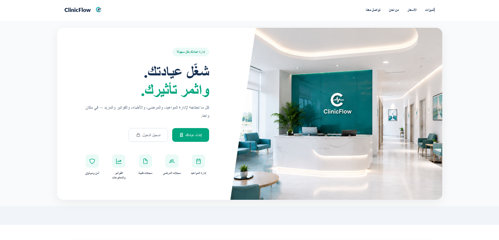
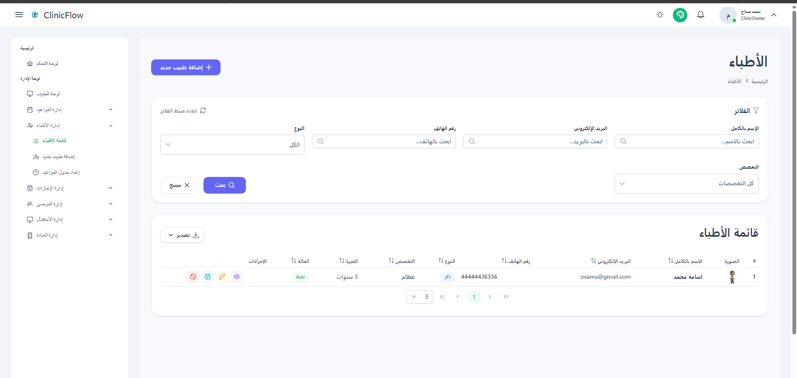
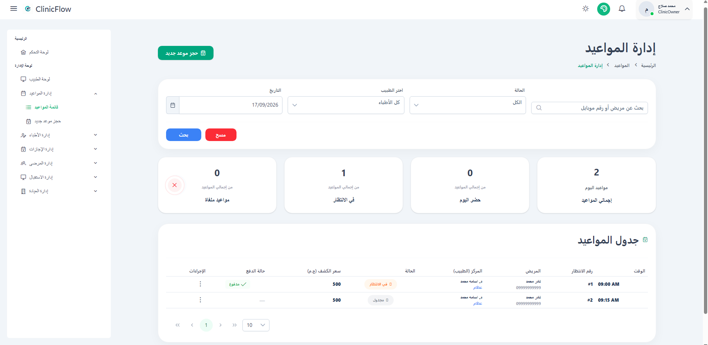
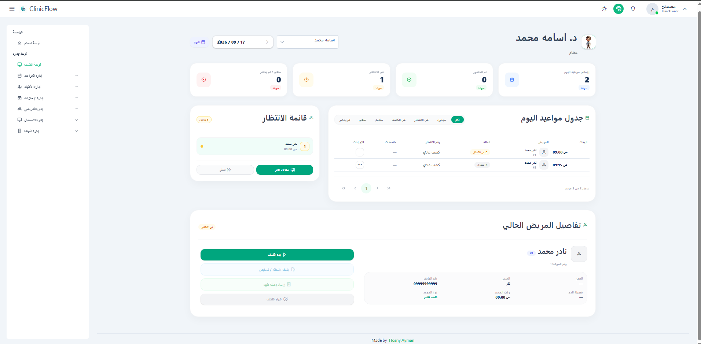
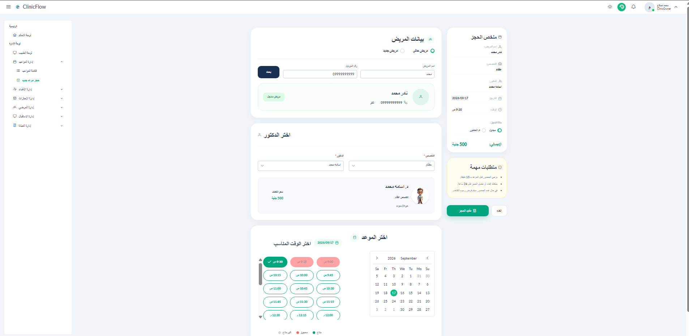

# ClinicFlow Frontend

A clinic management system frontend built with Angular and TypeScript.

## Overview

ClinicFlow is a web-based clinic management system that provides interfaces for managing clinics, doctors, patients, appointments, medical records, prescriptions, schedules, vacations, users, and system settings.

The frontend communicates with the ClinicFlow ASP.NET Core Web API and provides role-based and permission-based user experiences.

## Features

- User Authentication
- JWT Authentication
- Access Token Refresh
- Role-Based Access Control
- Permission-Based Access Control
- Clinic Management
- Doctor Management
- Patient Management
- Appointment Management
- Doctor Schedule Management
- Doctor Vacation Management
- Clinic Working Hours Management
- Medical Records Management
- Prescription Management
- User and Receptionist Management
- Specialty Management
- System Settings
- Clinic Setup
- Doctor Dashboard
- Public Clinic Pages
- Appointment Booking
- Responsive User Interface
- PDF Generation
- Rich Text Editing

## Tech Stack

### Frontend

- Angular 21
- TypeScript
- RxJS
- HTML5
- CSS

### UI & Styling

- PrimeNG
- Tailwind CSS

### Additional Libraries

- Chart.js
- jsPDF
- html2canvas
- html-to-image
- Quill

### Authentication & Authorization

- JWT
- Route Guards
- Permission Guards
- HTTP Interceptors
- Token Refresh

### Development Tools

- Angular CLI
- ESLint
- Prettier

### Testing

- Jasmine
- Karma

### Containerization & CI/CD

- Docker
- GitHub Actions

## Project Structure

The application follows a feature-based structure to keep related functionality organized and maintainable.

```text
ClinicFlow-Frontend
│
├── src
│   ├── app
│   │   ├── core
│   │   │   ├── guards
│   │   │   ├── interceptors
│   │   │   ├── services
│   │   │   └── ...
│   │   │
│   │   ├── features
│   │   │   ├── authentication
│   │   │   ├── clinic
│   │   │   ├── doctors
│   │   │   ├── patients
│   │   │   ├── appointments
│   │   │   ├── medical-records
│   │   │   ├── prescriptions
│   │   │   ├── doctor-schedule
│   │   │   ├── doctor-vacation
│   │   │   ├── clinic-working-hours
│   │   │   ├── users
│   │   │   ├── system-settings
│   │   │   └── ...
│   │   │
│   │   ├── layout
│   │   └── shared
│   │
│   └── assets
│
├── public
├── Dockerfile
├── angular.json
├── package.json
└── README.md
```

## Architecture

The frontend is organized around Angular features and shared application infrastructure.

### Core

Contains application-wide functionality such as:

- Authentication services
- HTTP interceptors
- Route guards
- Permission guards
- Shared core services

### Features

Each major business domain is organized as a separate feature.

Examples include:

- Authentication
- Clinics
- Doctors
- Patients
- Appointments
- Medical Records
- Prescriptions
- Doctor Schedules
- Doctor Vacations
- Clinic Working Hours
- Users
- System Settings
- Clinic Setup
- Doctor Dashboard
- Public Clinic Pages

### Shared

Contains reusable components, directives, validators, utilities, and other shared functionality used across multiple features.

## Authentication & Authorization

The frontend integrates with the ClinicFlow backend authentication system.

### Authentication

- JWT-based authentication
- Access token handling
- Automatic token refresh
- Authentication state management

### Authorization

The application supports:

- Role-based access control
- Permission-based access control
- Route protection using guards

Permission checks are also used to control access to specific frontend features and actions.

## HTTP Interceptors

The application uses HTTP interceptors for cross-cutting HTTP concerns, including:

- Sending authenticated requests
- Handling credentials
- Loading state management
- Access token refresh

## RxJS

RxJS is used throughout the application for reactive programming and asynchronous data handling.

It is used for:

- HTTP requests
- Application state flows
- Observable-based services
- Event handling
- Reactive UI interactions

## API Integration

The frontend communicates with the ClinicFlow ASP.NET Core Web API through Angular services.

API-related logic is separated from UI components to keep the application maintainable and easier to test.

## Forms & Validation

The application uses Angular forms and reusable validation logic for handling user input across different features.

## UI

PrimeNG and Tailwind CSS are used to build the application's user interface.

The application includes dashboards, management screens, forms, tables, dialogs, and responsive layouts for different clinic workflows.

## PDF & Document Features

The application supports generating PDF documents from application data.

## Testing

The project includes frontend testing support using:

- Jasmine
- Karma

## Docker

The project includes a Dockerfile for building and running the Angular application in a container.

## CI/CD

GitHub Actions is configured to automate the frontend workflow, including building the application and container image publishing.

## Getting Started

### Prerequisites

- Node.js
- Angular CLI

### Clone the Repository

```bash
git clone https://github.com/Hosny-Ayman/ClinicFlow-Frontend.git
cd ClinicFlow-Frontend
```

### Install Dependencies

```bash
npm install
```

### Run the Application

```bash
ng serve
```

The application will be available at:

```text
http://localhost:4200
```

## Backend

The frontend communicates with the ClinicFlow ASP.NET Core Web API.

### Backend Repository

[ClinicFlow Backend](https://github.com/Hosny-Ayman/ClinicFlow-Backend)

## Live Demo

[ClinicFlow Frontend](https://clinicflow-frontend-6upd.onrender.com/home)

## Screenshots

### Landing Page



### Doctors Management



### Appointments Management



### Doctor Dashboard



### Appointment Booking


